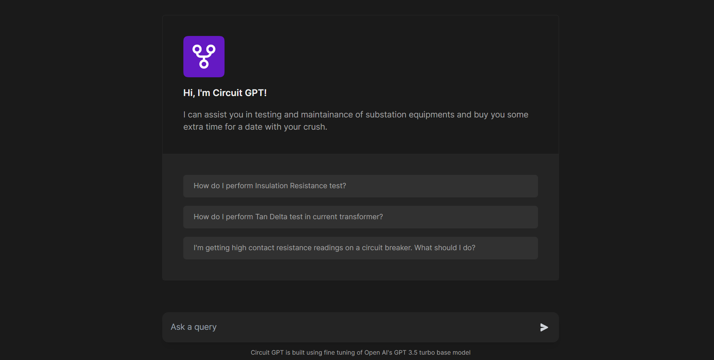

# Circuit GPT: Substation Equipment Maintenance AI Assistant

Circuit GPT is an intelligent AI assistant designed to streamline the process of answering user queries related to substation equipment maintenance and testing. This project leverages Next.js, TypeScript, and the OpenAI GPT-3.5 Turbo API to deliver advanced semantic query processing and data retrieval capabilities. Engineers can easily access maintenance guidance, test procedures, and issue resolution, making equipment maintenance more efficient and reliable.

## Features

### 1. Semantic Query Processing

Circuit GPT employs advanced semantic processing to understand the context of user queries, allowing for more contextually relevant responses. This ensures that users receive accurate and precise information.

### 2. Data Retrieval

Engineers can easily retrieve past-year testing data for equipment, facilitating informed decision-making. The system securely stores and retrieves historical equipment testing data for enhanced insights.

### 3. Maintenance Guidance

Engineers can request AI-driven instructions for equipment maintenance, adhering to industrial standards. The AI assistant provides step-by-step guidance, ensuring that maintenance tasks are carried out correctly.

### 4. Test Procedures

Users can access comprehensive test details, including limits, equipment requirements, and safety precautions. This feature enhances safety and efficiency during equipment testing.

### 5. Issue Resolution

Circuit GPT offers AI-powered troubleshooting for effective and safe maintenance issue resolution. Users can quickly identify and address equipment problems.

